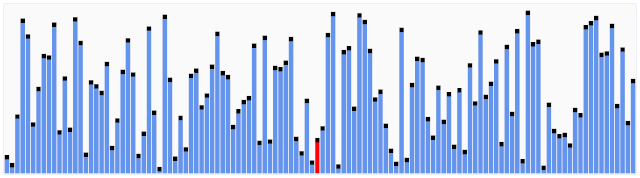

# push_swap

> A program that sorts data on a stack with specific constrains



## 🚫 Constrains
### ~ in structure 
We receive a list of unordered numbers and we have to sort them with the least operations possible.
- **2 stacks** : for the sorting, we have 2 stacks at our disposal. At the beginning, all numbers are on stack A abd stack B is empty. We can use stack B as temporary storage but after the sorting all numbers must be back in stack A. It's also worth noting that the stack must be created and can be a data structure of our choosing (array, linked-list,...)
- **11 possible operations**: the only operations we can perform to sort the numbers are the following:
    - <code>pa</code>, <code>pb</code> : pushing the value at the top of stack_A to the the top of stack_A or the inverse
    - <code>sa</code>, <code>sb</code>, <code>ss</code> : swapping the first two values at the top of stack_A, stack_B or both
    - <code>ra</code>, <code>rb</code>, <code>rr</code> : sending the value at the bottom of stack_A, stack_B or both at the bottom
    - <code>rra</code>, <code>rrb</code>, <code>rrr</code> : sending the value at the bottom of stack_A, stack_B or both over their top
### ~ in performance
Depending on the size of the list, the program must be below a certain number of operations:
- For a list of **3 numbers**: we need to sort it with not more than 3 instructions
- For a list of **5 numbers**: we need to sort it with not more than 12 instructions
- For a list of **100 numbers**:
    - 5 points if the size of the list of instructions is less than 700
    - 4 points if the size of the list of instructions is less than 900
    - 3 points if the size of the list of instructions is less than 1100
    - 2 points if the size of the list of instructions is less than 1300
    - 1 points if the size of the list of instructions is less than 1500    
- For a list of **500 numbers**:
    - 5 points if the size of the list of instructions is less than 5500
    - 4 points if the size of the list of instructions is less than 7000
    - 3 points if the size of the list of instructions is less than 8500
    - 2 points if the size of the list of instructions is less than 10000
    - 1 points if the size of the list of instructions is less than 11500

## 📝 Implementation
### ~ Storing the numbers in a doubly-linked list
Check if the numbers are valid, two ways of receiving numbers, storing in matrix, why a doubly-linked list, figma for visualizations especially for operations (pa, ra, sa,...)
### ~ Handling lists of size 3
### ~ Handling lists of size 5
### ~ Handling lists of size 100
For larger lists, I chose the quicksort algorithm. It has an average time complexity of __n*log(n)__

How quicksort works ->

1. Finding the pivot:
The ideal pivot will seperate your list in half.
To do so, I wrote a function <code>__find_pivot__</code> which calculates the average of all numbers of the list then finds in the list the closest number to that average, which becomes the pivot. 
It works perfectly when the list contains numbers close to each other or seprated evenly, but when there are multiple numbers close to each other and a few that are bigger, the function doesn't seperate the list quite as well. 
Ex:

```C
int list_A[] = {12, 4, 6, 1, 8, 18, 10}; // 6 is the pivot

int list_B[] = {12, 4, 6, 1, 8, 1801, 244}; // 244 is the pivot
```

2. Partitioning: 
> In computer science, partitioning refers to the division of a computer's hard drive, or other data storage device, into separate areas where data can be stored. These separate areas are called "partitions."
Key terms: partitioning, pivot, D&C (Devide and Conquer)

## ~ Optimizations
- Check if partitions are sorted before feeding them to the recursive quicksort algorithm. This logic cut in half the operations needed to sort the stack, from 10,000 to 5,000

## 💡 Learnings

- Sorting algorithms
- Big O notation and complexity in algorithms
- Data structure: implementing and manipulating a doubly-linked list

## 🫡 Final thoughts
